<div align="center">



<br/>

<a href="https://git.io/typing-svg">
  
</a>

<br/>


</div>

---

### 🧑‍💻 About Me

```yaml
name: Adarsh Gupta
role: Backend Developer | Distributed Systems Enthusiast
education: B.Tech ECE @ MSIT (GGSIPU) · 2023–2027
currently_learning: [Distributed Systems, Event-Driven Architecture]
status: Open to Opportunities
motto: "code. build. scale. repeat."
```

- 💻 Backend-focused B.Tech student building with **Java 21, Spring Boot, Kafka & PostgreSQL**.
- 🏢 Software Engineering Intern @ **Velocis Systems** — built an Employee Management System backend (Spring Boot, PostgreSQL, Redis, Docker).
- ⚙️ I like **concurrency, event-driven systems** and reliable messaging — transactional outbox, saga, idempotency.
- 📚 Currently sharpening my skills in System Design & Distributed Systems.
- 🧩 **270+ LeetCode** problems solved (150+ Medium, 30+ Hard).
- 🤝 Open to backend internships / full-time roles — let's connect!

---

### 🛠️ Tech Stack

<div align="center">

| Languages | Backend | Messaging & Data | DevOps / Tools |
|:---:|:---:|:---:|:---:|
|  |  |  |  |
|  |  |  |  |
|  |  |  |  |
| |  |  |  |

</div>

---

### 📊 GitHub Stats & Activity

> Generated automatically once a day by a GitHub Action running in this repo — no external live API, so it never breaks due to rate limits.

<div align="center">


</div>

<div align="center">


</div>

<div align="center">

### 📈 Daily Contribution Graph


</div>

---

### 🐍 Contribution Snake

> A pixel snake that eats through my daily commit graph — runs automatically every day via GitHub Actions.
> (One-time setup needed — see **Setup Notes** below.)

<div align="center">
  
</div>

---

### 🌐 Connect With Me

<div align="center">

[](https://www.linkedin.com/in/YOUR-LINKEDIN-ID/)
[](https://leetcode.com/u/YOUR-LEETCODE-ID/)
[](https://github.com/Kaddux)
[](mailto:adarshg352@gmail.com)

</div>

---

<div align="center">
<sub>⭐ If this README inspired your own profile, feel free to fork the idea — that's the whole point.</sub>
</div>
